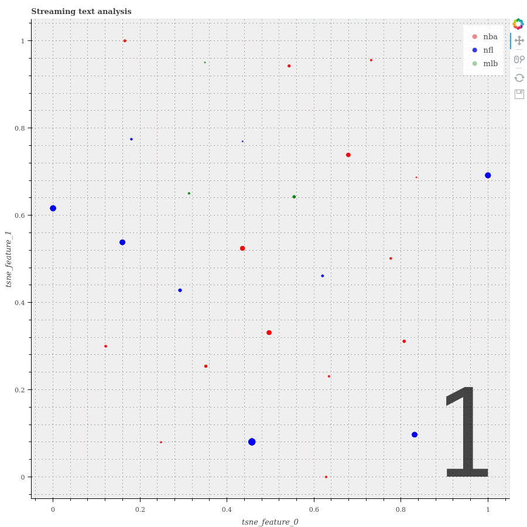

# Streaming Tweets Feature Learning with Spark



## Synopsis

#### As the diagram showing above, this project implements a pipeline that learns predictive features from streaming tweets and visualizes the result in real-time.


- **Receive streaming tweets on master machine**:    
    Running the TweetsListener.py script in the background, a tweets stream with 3 tracks-"NBA", "NFL" and "MBL" are pulled from Tweepy API. Inside this stream, each tweet has a topic about one of those 3 tracks and is seperated by delimiter "><". 


- **Analysis tweets on distributed machines**:    
    This stream is directed into Spark Streaming API through TCP connection and distributed onto cluster. Under the Spark Streaming API, the distrbuted stream is abstracted as a data type called DStream. A series of operations are then applied on this DStream in real time and transform it into other DStreams containing intermediate or final analysis results. 
    
    1. preprocess each tweet into a label and a list of clean words which contains only numbers and alphabets.
    2. count the frequencies of words in all tweets and take the top 5000 most frequent ones as features.
    3. encode the tweets in last half minute into a structured dataset using features mentioned above.
    4. calculate the conditional probability given label and the predictiveness of each feature word.
    
    
- **Visualize results on master machine**:   
    At last we select the tweets and features with higher predictiveness, collect their label, sum of predictiveness and 2 tsne features back onto the master machine and visualize them as a scatter plot. This visualization can be used as a informal validation of predictiveness defined above. If the scatter of different are well seperated, then the features selected by this predictiveness measure are valid.
    
    1. keep only 300 most predictive features and discard other non-predictive features.
    2. calculate the sum of predictiveness of each word in tweet.
    3. take 60 tweets with the highest sum of predictiveness under each label.
    4. apply TSNE learning on these 300 data points to reduce dimentionality from 100 to 2 for visualization.


## Files
- **tweet_feature_learning_SparkStreaming.ipynb**
    This jupyter notebook contains the code receiving tweets from socket, learn features and their stats and visualize selected tweets using learned features.
- **TweetsListener.py**
    This python script pulls realtime tweets from tweepy API and forward it to the assigned TCP connect.(If you are not using docker container, you need to modify the IPaddress information in this file as well as in tweet_feature_learning_SparkStreaming.ipynb to make the streaming work.)
- **StreamingPlot.py**
    This python script implements the streaming plotting class which generate a scatter plotting and keeps updating the plotting with new plotting data source.
- **pyspark_installation_guide.md**
    This markdown file contains guided steps on how to install Spark and pyspark.
- **Spark_overview.md**
    This markdown file briefly introduces what is Spark and the functionalities of it.
- **logs.txt**
    This text file is generated in tweet_feature_learning_SparkStreaming.ipynb to save intermediate and final analysis result.


### To run the notebook:
The Jupyter notebooks and scripts are implemented and working in docker container run from following docker image. 

1. Run the following command to start a container with the Notebook server listening for HTTP connections on port 8888.

`docker run -it -v localDir:/home/jovyan -p 8888:8888 xianlai/spark_project`

Here `-v localDir:/home/jovyan` allows you to mount a local volume to container and the `localDir` is the directory where you downloaded the above files.

Then you will see a notebook startup log messages like this:
```
Copy/paste this URL into your browser when you connect for the first time,
to login with a token:
    http://localhost:8888/?token=75b0b2062b7e8da090cc16d9581e3b9d98158903fcf8db36
```

2. Take note of the authentication token and include it in the URL you visit to access the Notebook server.

3. Open `tweet_feature_learning_SparkStreaming.ipynb` and run all cells.


## API Reference
- **Spark**: URL:http://spark.apache.org/
- **Tweepy** : URL:http://www.tweepy.org/
- **Bokeh**: Bokeh Development Team (2014). Bokeh: Python library for interactive visualization. URL:http://www.bokeh.pydata.org.


## License
MIT License

Copyright (c) [2017] [Xian Lai]

Permission is hereby granted, free of charge, to any person obtaining a copy of this software and associated documentation files (the "Software"), to deal in the Software without restriction, including without limitation the rights
to use, copy, modify, merge, publish, distribute, sublicense, and/or sell copies of the Software, and to permit persons to whom the Software is
furnished to do so, subject to the following conditions:

The above copyright notice and this permission notice shall be included in all
copies or substantial portions of the Software.

THE SOFTWARE IS PROVIDED "AS IS", WITHOUT WARRANTY OF ANY KIND, EXPRESS OR
IMPLIED, INCLUDING BUT NOT LIMITED TO THE WARRANTIES OF MERCHANTABILITY,
FITNESS FOR A PARTICULAR PURPOSE AND NONINFRINGEMENT. IN NO EVENT SHALL THE
AUTHORS OR COPYRIGHT HOLDERS BE LIABLE FOR ANY CLAIM, DAMAGES OR OTHER
LIABILITY, WHETHER IN AN ACTION OF CONTRACT, TORT OR OTHERWISE, ARISING FROM,
OUT OF OR IN CONNECTION WITH THE SOFTWARE OR THE USE OR OTHER DEALINGS IN THE
SOFTWARE.

## Contact
Xian Lai
Data Analytics, CIS @ Fordham University
XianLaaai@gmail.com
